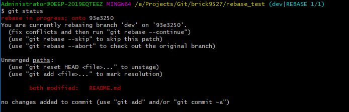

# Rebase操作流程

## 背景

- 自己有一个开发分支`dev`
- 想rebase到公公开发分支`master`

## 操作步骤

1. 切换到`master`分支

```bash
git checkout master
```

2. 更新`master`分支

(master)
```bash
git pull origin master
```

3. 查看当前分支状态

在Git Bash中输入如下命令查看当前分支状态。

(master)
```bash
git log --graph --pretty=oneline --all
```

可以看到当前我们的项目分支状态是：


分支`dev`与分支`master`出现分叉。且`master`有更新的节点出现。

4. 切换到`dev`分支

使用命令切换到`dev`分支

(master)
```bash
git checkout dev
```

5. 在`dev`分支对`master`使用`rebase`命令

(dev)
```bash
git rebase master
```

此时会出现冲突，自行手动解决冲突。然后运行`git rebase --continue`命令。


6. 解决冲突之后，查看项目状态

使用命令status查看当前项目状态。（红色为未添加提交）

(dev)
```bash
git status
```



7. 添加文件

添加所有文件到提交状态

(dev)
```bash
git add .
```

8. 继续rebase

(dev)
```bash
git rebase --continue
```

9. 查看分支状态

继续使用`log`命令查看分支状态

(dev)
```bash
git log --graph --pretty=oneline --all
```

可以看到当前分支状态如下：


**重点**

- `dev`分支的内容已经成为了`master`分支的后续节点（“添加dev内容”）
- 远程仓库的头（HEAD）依然还在“添加master新内容”处。（注意看`origin/HEAD`）
- 本地仓库的头（HEAD）已经在rebase之后的节点“添加dev内容”上了。（注意看`HEAD -> dev`）

10. 切换到`master`分支

(dev)
```bash
git checkout master
```

11. merge一下之前使用rebase的开发分支

(master)
```bash
git merge dev
```

12. 将新内容push到远程分支

(master)
```bash
git push origin master
```

13. 再次查看分支状态

(master)
```bash
git log --graph --pretty=oneline --all
```

可以看到


- 远程仓库的头也到了最新的部分


至此，rebase操作完成。`dev`分支内容已经完全接上了`master`分支，从而省略了merge这一步操作。